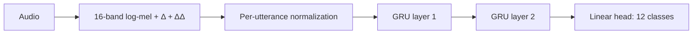

# Quantized Keyword Spotting

Hardware-constrained keyword spotting with two-layer GRUs and custom INT8
post-training quantization in PyTorch, developed as part of an IC design project.
The training and calibration pipeline explores accuracy and storage tradeoffs
under these hardware constraints:

- Architecture: 2 stacked unidirectional GRU layers + linear head
- Max hidden size: 64 (≈ 47k parameters total)
- Output classes: 12 (10 keywords + unknown + silence)
- Dataset: Google Speech Commands v2

## Results

Google Speech Commands v2, 12 classes, 16 mel bands with Δ/ΔΔ features,
two GRU layers, and hidden sizes 16–64. Values below are mean ± sample standard
deviation across seeds 0, 1 and 2 from the committed
[sweep 17803125](keyword_spotting/results/ptq_sweep/17803125/).
Calibration used 16 batches and the 99.99th percentile.

<!-- results:start -->
| Hidden size | Parameters | FP32 test accuracy | INT8 simulation test accuracy | Weight storage FP32 → INT8 |
|---:|---:|---:|---:|---:|
| 16 | 5,004 | 94.85 ± 0.11% | 94.59 ± 0.10% | 18.75 → 4.69 KiB |
| 32 | 14,604 | 96.57 ± 0.23% | 96.43 ± 0.29% | 55.50 → 13.88 KiB |
| 48 | 28,812 | 97.11 ± 0.08% | 97.04 ± 0.14% | 110.25 → 27.56 KiB |
| 64 | 47,628 | 97.24 ± 0.16% | 97.17 ± 0.09% | 183.00 → 45.75 KiB |
<!-- results:end -->


For GRU-64, the mean accuracy decrease is **0.072 percentage points**.
INT8 weights require one quarter of the FP32 weight storage. These are static
representation estimates, not measured process memory, inference speedups or an
FPGA implementation. The PTQ evaluator uses quantize/dequantize simulation with
floating-point operations and biases. Weight sizes exclude biases, scales and
frontend buffers; the archived total-size reports use different buffer/bias
assumptions and should not be interpreted as deployed model sizes.

Each run's `summary.json` records accuracy and configuration; `size_report.json`
records storage estimates. Rebuild this table and both figures with:

```bash
python keyword_spotting/scripts/publish_results.py
```

## Architecture



## Setup

```bash
git clone git@github.com:mxlaine/PTQ_project.git
cd PTQ_project
python -m venv .venv
source .venv/bin/activate
pip install -r keyword_spotting/requirements.txt
```

The Google Speech Commands v2 dataset is downloaded automatically by
`torchaudio` into `keyword_spotting/data/` on the first run.

## Model

`KeywordGRU` ([keyword_spotting/src/model.py](keyword_spotting/src/model.py)):

- 16- or 48-band log-mel spectrogram, optional Δ and ΔΔ features,
  per-utterance mean/std normalisation.
- 2 unidirectional GRU layers + linear classifier head.
- SpecAugment (frequency + time masking) applied to
  the mels and deltas/delta-deltas before normalisation.

### Custom GRU (`NewGRU`)

[keyword_spotting/src/new_gru.py](keyword_spotting/src/new_gru.py) reimplements
a GRU to have better visibility of weights for post-training quantization:

- TorchScript-compiles the recurrent loop to reduce Python-loop overhead and
  expose GRU parameters for custom quantization.
- Numerical parity tests compare outputs and hidden states with `torch.nn.GRU`.
- Slower than the cuDNN-backed `torch.nn.GRU` implementation.

## Training pipeline

`src/main.py` is main entry point of training, testing and validation. Various flags allow different 
parameters to be tested:

- Data augmentation with random time shift, background-noise mixing at
  SNRs in 0–15 dB (drawn from the Speech Commands `_background_noise_` clips),
  silence synthesis (10% of each batch), SpecAugment.
- Optional BC-ResNet style under-sampler that
  draws an equal number of examples from each class (unknown class is much larger than other classes in
  original dataset due to the task being a subset of the full 35 class task).
- Optimisation with AdamW, gradient clipping, label smoothing, cosine LR decay or
  cosine warm restarts with optional linear warmup and per-cycle ceiling decay.
- Seed controls model for reproducibility.

Run locally (with the virtualenv from **Setup** active):

```bash
python keyword_spotting/src/main.py --help
```

Example training run:

```bash
python keyword_spotting/src/main.py --use-new-gru --spec-augment \
  --balanced-sampler --label-smoothing 0.05 --lr-scheduler cosine --epochs 325
```

## PTQ (Post-Training Quantization)

`src/calibrate_ptq.py` loads an FP32 checkpoint,
runs percentile-based INT8 calibration, evaluates accuracy, writes
`scales.json`, `summary.json`, and `size_report.json` to `--out-dir`, and
prints a full "Static model footprint / Memory bandwidth / Layer-by-layer"
breakdown to stdout. The quantisation modules live in
[keyword_spotting/src/ptq/](keyword_spotting/src/ptq/).

## Experiment infrastructure

Every experiment is a SLURM array job under [keyword_spotting/slurm/](keyword_spotting/slurm/),
parameterised so a single submission sweeps a Cartesian product of settings.
Active scripts:

- `run_keyword_gru_size_sweep.sbatch` — hidden size sweep (16/32/48/64)
- `run_ptq_sweep.sbatch` — PTQ calibration sweep across hidden sizes and seeds
- `run_ptq_single.sbatch` — single PTQ calibration run

The sbatch scripts resolve the project and virtualenv from the `PROJECT_ROOT`
and `VENV_ACTIVATE` environment variables (they fall back to the author's
cluster paths). Set them for your own environment when submitting:

```bash
PROJECT_ROOT=/path/to/keyword_spotting \
VENV_ACTIVATE=/path/to/.venv/bin/activate \
sbatch keyword_spotting/slurm/run_ptq_sweep.sbatch
```

Each task writes its training log into a directory under `slurm/<jobid>/`,
and the best checkpoint into `models/<jobid>/`. Plots of train/val/test curves
are created under `plots/<jobid>/`.

Every sweep includes the four required hidden
sizes (16, 32, 48, 64).

## Analysis tooling

[keyword_spotting/scripts/](keyword_spotting/scripts/) contains small CLIs for
post-hoc analysis:

- `plot_from_log.py` regenerate training curves from a single log file.
- `plot_sweep.py` / `plot_group.py` overlay curves across a sweep or across
  re-seeded "best-of" runs.
- `summarize_results.py` parse logs across one or more job directories into a
  table of best/final accuracy, runtime, and configuration. 

## Tests

[keyword_spotting/tests/](keyword_spotting/tests/) holds numerical-parity and
quantisation checks (custom GRU vs `torch.nn.GRU`, PTQ round-trip). Run them with:

```bash
cd keyword_spotting && python -m pytest tests/
```

## Reproducibility and environment

Training and calibration were primarily run on Aalto University's Triton cluster
with NVIDIA V100 GPUs. CPU and other accelerator performance has not been
benchmarked. Install the pinned PyTorch/torchaudio versions in the requirements
file to reproduce the original environment.

The committed summaries support regenerating the presentation above without a
GPU or dataset download. Re-running accuracy evaluation also requires the original
trained checkpoints (the summaries reference cluster-local paths) and Speech
Commands v2. Checkpoints are not bundled with these results.

## Tech stack

PyTorch, torchaudio, TorchScript, NumPy, Matplotlib, SLURM.
