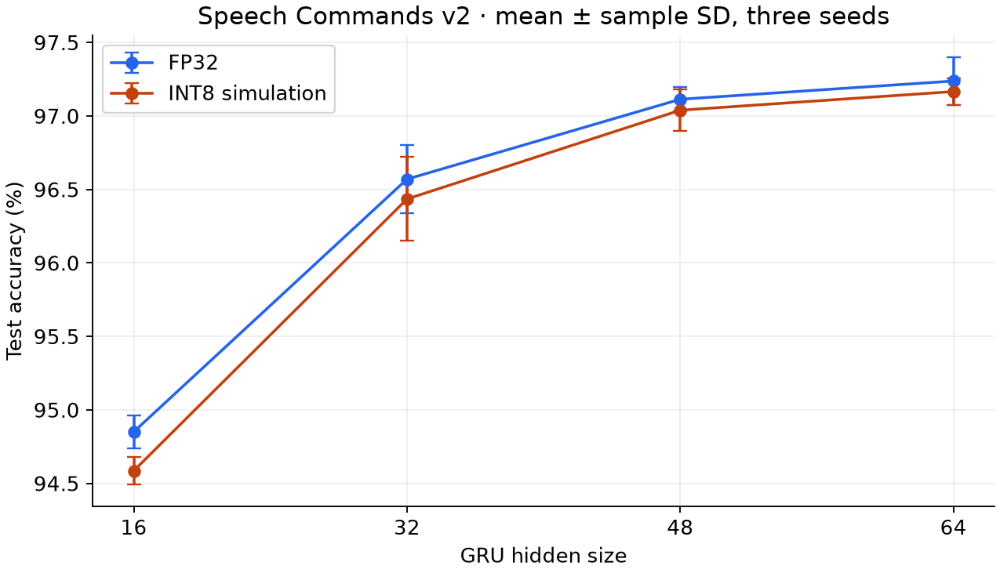
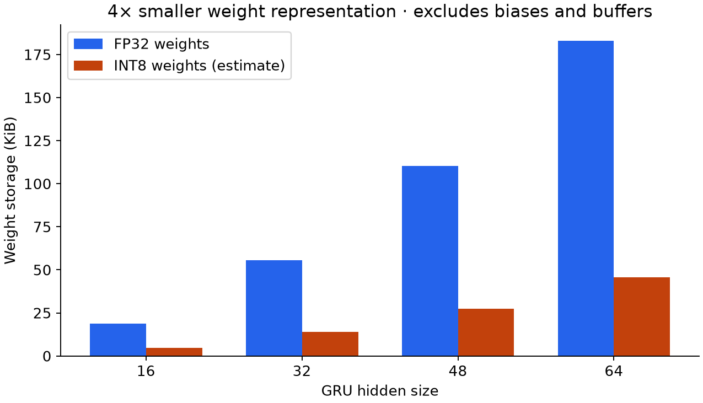

# Quantized Keyword Spotting

This IC design project studies how much accuracy a small keyword-spotting GRU
loses under INT8 post-training quantization. The model constraints were two
unidirectional GRU layers, a maximum hidden size of 64, and a linear head for
12 classes (ten keywords, unknown, and silence).

## Results

At hidden size 64, mean test accuracy changes from **97.24% to 97.17%** across
three seeds. Hidden size 48 reaches an accuracy of **97.04%** after quantization with about
40% less weight storage than hidden size 64.

These results use 16 log-mel bands with delta / delta-delta features, two GRU layers, and
seeds 0, 1, and 2 from [sweep 17803125](results/ptq_sweep/17803125/).
The table reports mean {\pm} sample standard deviation. Calibration used 16 batches
and the 99.99th percentile.

<!-- results:start -->
| Hidden size | Parameters | FP32 test accuracy | INT8 simulation test accuracy | Weight storage FP32 → INT8 |
|---:|---:|---:|---:|---:|
| 16 | 5,004 | 94.85 ± 0.11% | 94.59 ± 0.10% | 18.75 → 4.69 KiB |
| 32 | 14,604 | 96.57 ± 0.23% | 96.43 ± 0.29% | 55.50 → 13.88 KiB |
| 48 | 28,812 | 97.11 ± 0.08% | 97.04 ± 0.14% | 110.25 → 27.56 KiB |
| 64 | 47,628 | 97.24 ± 0.16% | 97.17 ± 0.09% | 183.00 → 45.75 KiB |
<!-- results:end -->




Weight storage counts weights only: four bytes per FP32 weight versus one byte
per INT8 weight. Biases, scales, and frontend buffers are excluded. It is an
estimate of representation size, not a measurement of runtime memory or speed.
The archived total-size reports use different bias/buffer assumptions.

All **12 FP32 checkpoints** behind this table are included in the
[checkpoint bundle](checkpoints/published-sweep/), together with
training/evaluation logs and a manifest linking each file to its result and SHA-256 checksum.
The weights total about 1.38 MiB. The archived summaries retain their original
Triton paths; the reproduction command below uses the bundled local files.

## Why a custom GRU?

[NewGRU](src/new_gru.py) exposes the recurrent cell's intermediate
values so calibration can observe and quantize them. Its recurrent loop uses
TorchScript; it is slower than the cuDNN-backed `torch.nn.GRU` implementation.
The tests compare its outputs and hidden states with `torch.nn.GRU`.

[The PTQ cell](src/ptq/quant_new_gru.py) quantizes input and
recurrent weights, inputs, linear outputs, hidden states, and gate outputs.
Weights use max-based scales; activations use percentile calibration, while
sigmoid and tanh outputs use fixed ranges. Biases and arithmetic remain
floating point. Integer accumulation, nonlinear approximations, and deployment
latency would need separate validation on the target hardware.

The [audio frontend](src/model.py) produces log-mel features,
optionally adds Δ/ΔΔ, and normalizes each utterance before the two GRU layers
and classifier. The training code includes time shifts, background noise,
SpecAugment, and optional class balancing. Checkpoints are selected by validation
accuracy and evaluated on the test split after training.

## Run locally

```bash
git clone https://github.com/mxlaine/quantized_keyword_spotting_gru.git
cd quantized_keyword_spotting_gru
python -m venv .venv
source .venv/bin/activate
pip install -r requirements.txt
python -m pytest tests/
```

PyTorch and torchaudio are pinned to 2.8.0. Training and calibration were run
primarily on Aalto University's Triton cluster with NVIDIA V100 GPUs; the
requirements file does not lock the entire cluster environment.

To regenerate the results presentation without a dataset or GPU, only
Matplotlib and the Python standard library are needed:

```bash
python scripts/publish_results.py
```

This updates the table in this README and the figures in `docs/images/`, including
[the weight-storage plot](docs/images/weight-storage.png).

### Evaluate the published checkpoints

Verify all bundled files without installing PyTorch or downloading data:

```bash
python scripts/reproduce_results.py --all --verify-only
```

With the project dependencies installed, rerun the hidden-size-64, seed-0 result:

```bash
python scripts/reproduce_results.py --hidden-size 64 --seed 0
```

Use `--all` to rerun all 12 configurations. Speech Commands v2 is downloaded on
first use. The script verifies checkpoint hashes, recalibrates on 16 validation
batches (`--batch-size-eval 256`, with 25 synthetic silence clips added to each
full batch), then evaluates FP32 and simulated INT8 test accuracy.
New reports go to `results/reproduced/`; the archived table is
unchanged. Results can vary with hardware and library versions. Silence clips
are sampled during evaluation, so the FP32/INT8 comparison also includes variation
from those samples; it is not a comparison on an identical fixed set of silence clips.

### Train and calibrate

Training downloads Speech Commands v2 through `torchaudio` into
`data/` on first use. This example uses the 16-band Δ/ΔΔ
configuration and hidden size 64, with the training settings recorded in
[the original log](checkpoints/published-sweep/training-logs/h64_s0.txt):

```bash
python src/main.py \
  --feature-config 16_mels_delta_delta --hidden-size 64 --seed 0 \
  --use-new-gru --spec-augment --freq-mask-param 5 --time-mask-param 0 \
  --lr 0.002 --weight-decay 0 --dropout 0.1 --lr-scheduler cosine \
  --lr-warmup-epochs 10 --epochs 325
```

After training, pass the saved FP32 checkpoint to calibration:

```bash
python src/calibrate_ptq.py \
  --checkpoint /path/to/checkpoint.pt \
  --feature-config 16_mels_delta_delta --hidden-size 64 --seed 0 \
  --calib-batches 16 --percentile 99.99 --out-dir ptq-output
```

Calibration writes `scales.json`, `summary.json`, and `size_report.json`.
The checkpoint architecture must match the feature configuration and hidden size.
Both entry points provide `--help` for the remaining options.

### Cluster runs

[The SLURM scripts](slurm/) contain the training size sweep,
PTQ sweep, and single-run calibration job. Submit from the repository root.
The scripts use the submission directory as `PROJECT_ROOT` and its `.venv/`
by default; override either path when needed:

```bash
PROJECT_ROOT=/path/to/quantized_keyword_spotting_gru \
VENV_ACTIVATE=/path/to/.venv/bin/activate \
sbatch slurm/run_ptq_sweep.sbatch
```

The PTQ sweep also needs a `CHECKPOINT_INDEX` JSON file mapping each feature
configuration, hidden size, and seed to an available checkpoint. The default is
`$PROJECT_ROOT/results/ptq_checkpoint_index.json`; its paths are relative to the
repository root. The 12 published configurations
point to bundled checkpoints; other entries expect local files under `models/`.
Provide those files or set `CHECKPOINT_INDEX` to your own index before submitting
the other feature configurations.

The training sweep covers hidden sizes 16/32/48/64, three feature configurations,
and three seeds. [Analysis scripts](scripts/) summarize logs
and regenerate training curves.

## Test coverage

The tests check random-input GRU parity, quantize/dequantize error, parity with
quantization disabled, and a calibration/evaluation smoke test with random
weights. A separate test verifies the bundled checkpoint hashes and compares
`NewGRU` with `torch.nn.GRU` using all 12 trained weight sets and synthetic inputs,
without a dataset download:

```bash
python -m pytest tests/test_published_checkpoints.py
```

The older 24-band checkpoint accuracy test still requires a separate checkpoint
and is skipped when it is absent. Synthetic-input parity does not measure keyword
accuracy; use the reproduction command above for dataset evaluation. Neither
check establishes equivalence to integer hardware.
